# Docker and kubernetes: the complete guide
## Section 1: dive into Docker

### 1. Code Repositories and Diagrams: 
- [Diagrams](https://github.com/StephenGrider/DockerCasts/tree/master/diagrams)
- [Main repository](https://github.com/StephenGrider/DockerCasts)
- [Code for the AWS react single container project](https://github.com/StephenGrider/docker-react)

### 10. Installing Docker on CentOS
https://docs.docker.com/engine/install/centos/

### 11. Using the docker client
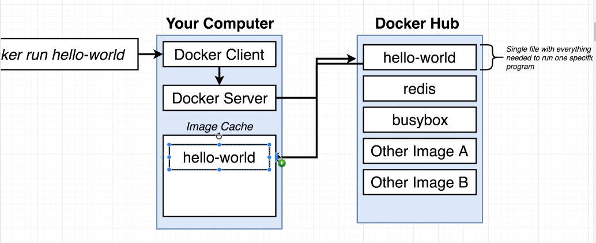

### 12. What is a container?
  Imagine the following situation. We want to run chrome in our computer using
  python2 and Nodejs using python3. 

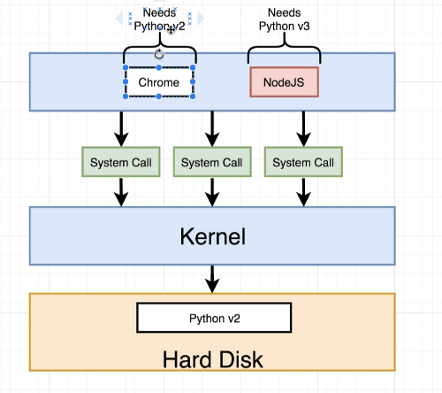

  One way to do it is to use an operating system feature known as namespacing. 
  With namespacing we can segment out portions of the hardware resources 
  connected to our computer. We can create a segment of our harddisk specifically
  dedicated to housing python2 and a second one for python3. Then, to make 
  sure that Chrome has access to the segment with python2 and NodeJs to the 
  segment with python3, any tie that either them issues a system call, the 
  kernel will look at that system call, try to figure out where it is coming 
  from and direct the call over the appropriate segment. 

  Another feature related to namespacing is control groups. A control group 
  can be use to limit the amount of resources that a given process can use.

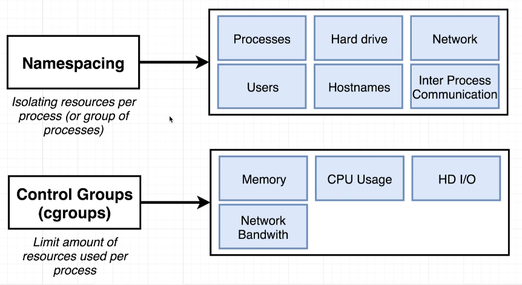

  The red dashed box is what we refer to as a container

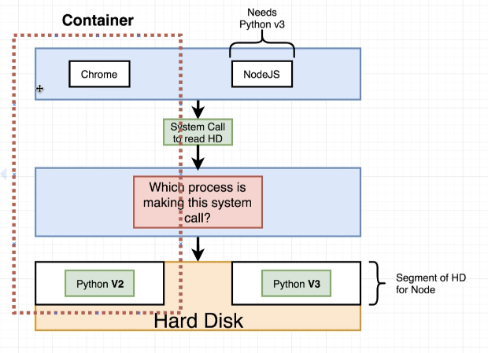

  A container is a process or a set of processes that have a grouping of 
  resources specifically assigned to it. So, we have a system process that 
  sends an system call to the kernel. The kernel will look at this incoming 
  call and direct it to a very specific portion of the harddrive, RAM, CPU and 
  network. Now, what is the relationship between a container and its image?
  Everytime we talk about an image, we are actually talking about a 
  filesystem snapshot.
  
<table style="">
<tr>
<th> 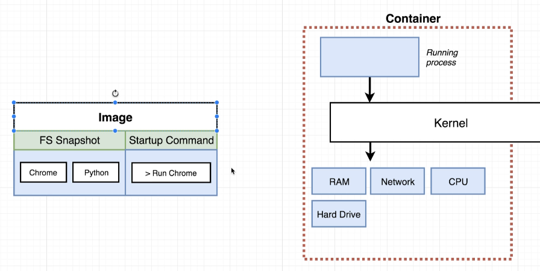</th>
<th></br></br></br>--></br> --></br> --></br> --></br> -->
   </br> --></br> --></br> --></br> --></br> -->
   </br> --></br> --></br> --></br> --></br> --></br> --></th>
<th>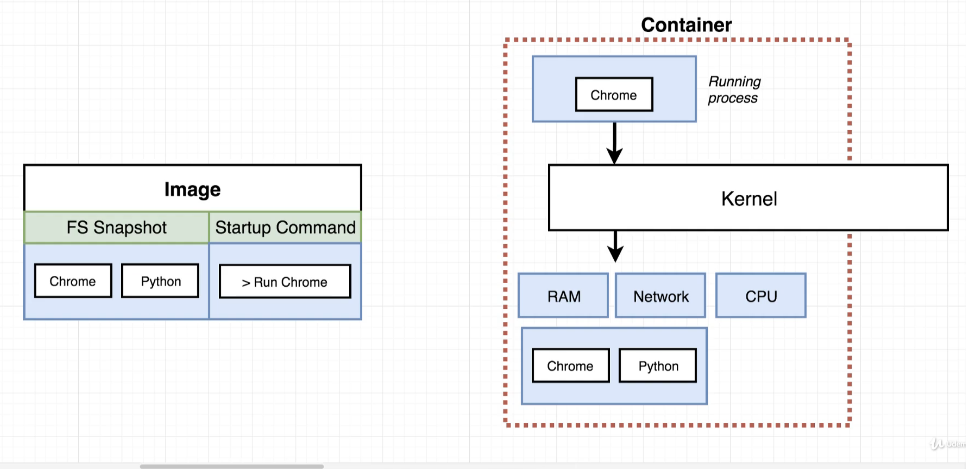</th>
</tr>
</table>

### 13. How is docker running on your computer

Namespacing and control groups are specific to the Linux operating system.
When you install Docker for Windows or Docker for macOS a Linux virtual
machine is installed.

## Section 2: manipulating containers with the Docker client

### 14. Docker run in detail

To create and run a container fromm an image, we do:
```
$ docker run <image_name>
```
When we execute this command, what happens is sketched in the following image

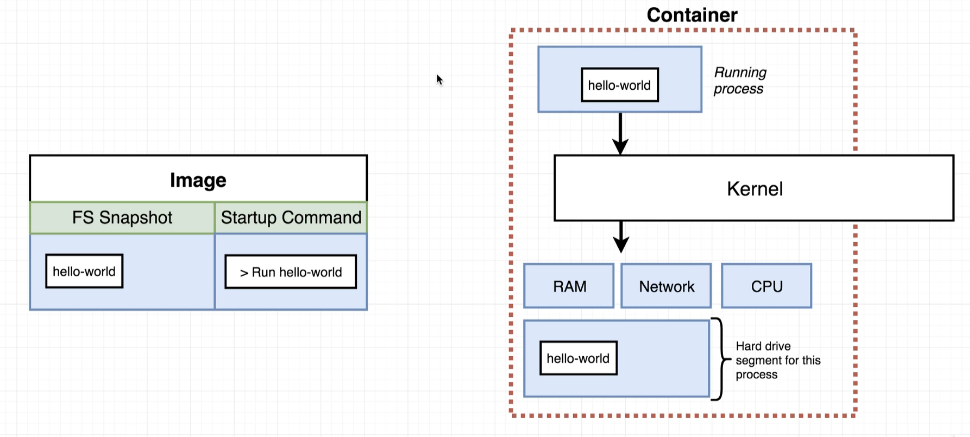


### 15. Override default command

We execute 
```
$ docker run <image_name> [command]
```
the command `run` tries to create and run a container. `<image_name>` is the 
name of the image to use for this container and `[command]` is the default
command override that has to exist in the image. 


### 16. Listing all running containers
To list all running containers run, 
   ``` 
   $ docker ps 
   ```
to list all containers that have run so far:
   ``` 
   $ docker ps --all 
   ```

### 17. Container lifecycle

   The command `docker run` is actually `docker create <image_name>` + 
   `docker start <containerID>`. When the container is created, the snapshot 
   of the image is taken and prepared for use in the operating system. Start
   the container means: run the start up command. Steps: 

```
cubo:~| docker create hello-world
178e35073f253f2b5906b433a991e2d91f5206ce1ebbda697f1891024b396383
cubo:~| docker start -a 178e35073f253f2b5906b433a991e2d91f5206ce1ebbda697f1891024b396383

Hello from Docker!
This message shows that your installation appears to be working correctly.

To generate this message, Docker took the following steps:
 1. The Docker client contacted the Docker daemon.
....
```

If you do not use the option `-a`, it won't attach the standard output 
and you will see nothing.

### 18. Restarting stopped containers

You can restart a stopped container by using its ID, which can be retrieved
from `docker ps -all`

```
cubo:~| docker ps -all
CONTAINER ID        IMAGE               COMMAND             CREATED             STATUS                     PORTS               NAMES
178e35073f25        hello-world         "/hello"            5 minutes ago       Exited (0) 4 minutes ago                       loving_hermann
cubo:~| docker start -a 178e35073f25

Hello from Docker!
This message shows that your installation appears to be working correctly.

To generate this message, Docker took the following steps:
 1. The Docker client contacted the Docker daemon.
 2. The Docker daemon pulled the "hello-world" image from the Docker Hub.
    (amd64)
...
```
Note that in this case, a "short" version of the ID is displayed, and it is 
assumed to be unique. 

### 19. Removing stopped containers
```
cubo:~| docker system prune
```

### 20. Retrieving log outputs 
```
$ docker logs <ContainerID>
```
shows everything it's been printed, so if you start the container without 
attaching to it, you can still check the output by using this command.

### 21. Stopping containers 

```
$ docker stop <ContainerID>  # SIGTERM 
$ docker kill <ContainerID>  # SIGKILL
```

### 22. Multi command containers
We sometimes need to run commands in running container. Example: redis 
server and redis cli. (see next section).


### 23. Executing commands in running containers

If we want to execute an additional command in a container, we can use: 

```
$ docker exec -it <ContainerID> <command>
```
 - `-i`: attach our terminal to std-in of the command,
 - `-t`: attach to the terminal. 


### 24. Getting a commmand prompt in a container
```
$ docker exec -it <ContainerID> sh
```

### 26. Starting with a shell
```
$ docker run -it <image_name> sh
```
however you can do nothing else... So maybe it is better to go for the `exec`
command. 

REMEMBER: two containers DO NOT share their filesystems.


## Section 3: Building custom images through Docker Server

### 28. Create docker images


<th> 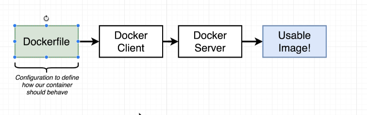</th>

<th> 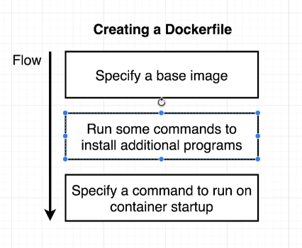</th>

### 29. Building  a Dockerfile

The steps are: 

1. Create a directory: `mkdir redis_image; cd redis_image`
2. Create a file called `Dockerfile` inside that folder containing
   ```
   # Use an existing docker image as a base
   FROM alpine

   # Download and install a dependency
   RUN apk-add --update redis

   # Tell the image what to do when it starts as a container
   CMD ["redis-server"]
   ```
3. Run `docker build .` It will end with `Successfully build ID`. 
4. Run  `docker run <ID>` Last message we should see is `Ready to accept connections`
 

### 30. Dockerfile teardown


### 31. What is a base image

Writing a docker file is "a little bit" just like being given a computer with 
no OS on it and being told to install something on it.

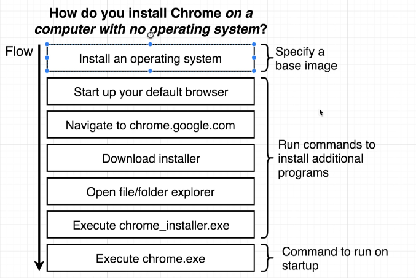

`alpine` is a docker image that comes with a preinstalled set of programs that 
are useful.

### 32. The build process in detail

When we run `docker build .`, we give the `Dockerfile` off to the docker-cli. 
The build command is what we use to take th `Dockerfile` and generate a docker 
image out of it. The `.` specifies the context. We get a Step for every line 
in the docker file. 
```
Step 1/3: FROM alpine
```
The docker server looks in the docker cache to see whether this image has ever
been donwloaded before. If not, it gets it from the docker hub. 
```
Step 2/3: RUN apk add --update redis-server
```
After this step, we read : `Running in <ID>`. This is an intermediate container 
being created. The same happens in the third step again. When `RUN` is executed, 
it looks into the previous line `FROM alpine` and creates a container out of the image. 
So, in memory we get a brand new temporary container out of the image sourced
in the previous step.

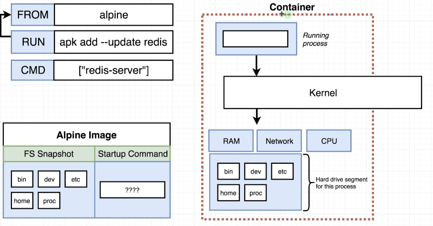

Then, a snapshot is created and the temporary container is stopped. The same 
procedure happens again in the second step.

```
Step 3/3: CMD ["redis-server"]
```

We look at the image generated in the previous step, create a new temporary 
container, and then, the container is told: if you were ever about to run, 
  this is your primary command. This temporary container is shutdown and 
  then a snapshot is taken with the primary command. 

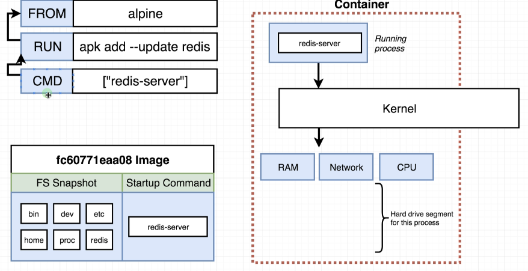


### 33. A brief recap                                                 
                                                                                  
 * FROM `alpine`                                                                  
     - Download alpine image                                                      
 * RUN `apk-add --update redis`                                                  
   - Get image from prvious step                                                  
   - Create a ontainer out of it --> Container!                                  
   - Run `apk add --update redis` in it --> Container with modified FS            
   - Take snapshot of that container-s FS --> FS snapshot                        
   - Shut down the temporary container                                            
   - Get the image ready for next instruction                                    
 * CMD `["redis-server"]`                                                        
   - Get image from prvious step                                                  
   - Create a ontainer out of it --> Container!                                  
   - Tell container it should run `'redis-server'` when started -> Container! with modified primary command
   - Shut down the temporary container                                            
   - Get the image ready for next instruction                                    
                                                                                  
 ### 34. rebuilds with cache                                                      
  Let s say we added a line to our docker file:                                  
 ```                                                                              
    RUN apk add --update gcc                                                      
 ```                                                                              
 we run the command `docker build .` again and when it goes through the build,    
 in the second step, it says: `Using cache`. Rather than going through            
 the process, since this temporary container is cached in your local computer,    
 it fetches it directly. Then it goes on and generates a tmp container for        
 the gcc installation. If the order o operations is changed, then the cache      
 cannot be used! So if you ever have to change the docker file, you want to add instructions  
 as far down as possible. The order of the instructions can drammatically change how long it takes
 to rebuild an image.                                                              
                                                                                  

### 35. Tagging an image
```
docker build -t (DockerID)/(Repo|ProjectName):(Version) .
```
For example: 
```
   docker build -t stephegrinder/redis:latest .
```

 Then you can do:
 ```
    docker run stephengrinder/redis
 ```

### 36. Manual image generation with docker commit
 you can take a container and generate an image out of it, that can be used 
 any time in the future. Example.

 ```
# Run on terminal one
$ docker run -it alpine sh
/ # apk add --update redis
```
On a second terminal we take a snapshot of that running container, asign a 
default command to it and generate an image out of the entire thing

```
# ID can be obtained with docker ps
docker commit -c 'CMD ['redis-server']' <ID> 
```
For the ID's, you do not need to take the entire ID, you can take an arbitrary 
number of characters, and it will recognize it. This command returns an ID 
that you can then use to run: docker run `<NEW ID>`. You do not really want 
to call `docker commit`, you want to write a `Dockerfile` instead.

## Section 4: making Real projects with Docker

### 37. Outline

Goal: create a node js web application in a docker container. Steps:
* Create Node JS web app
* Create a Dockerfile
* Build image from Docker file
* Run image as container
* Connect to web app from a browser

### 39. Node server setup and a few planned errors
* Specify a base image (`FROM alpine`)
* Run some commands to install additional programs (`RUN npm install`)
* Specify a command to run on a container setup (`CMD["npm", "start"]`)

**Detour**: we need to have to install a set of dependencies by running 
`npm install` and then, we need to run a command 
start up the server: `npm start`. So, you need to have `npm` (node package 
manager) installed. 

First we need to create a simple Node JS web app, see [index.js](./code/simple_web/index.json), 
[package.json](./code/simple_web/package.json) and put them inside a folder.
Next, we create a Dockerfile with the three instructions above and we will 
see that it'll lead to an error. Alpine does not have npm installed. 
There's two ways we can proceed. 

This will not work, since `npm` is not available in our base image, `Alpine`.

### 40. Base Image Issues

We can either install `npm` in our Alpine image, or go to [Docker-hub](http://hub.docker.com) 
and get an image that has `npm` preinstalled on it.

```
FROM node:alpine
```

Alpine is a tag and it means: as small and compact as possible. This solves 
the first problem, but if we try to build the image again, we get: 

```
cubo:~/Documents/programming_test/docker/simple_web| docker build . 
Sending build context to Docker daemon  4.096kB
Step 1/3 : FROM node:alpine
alpine: Pulling from library/node
cbdbe7a5bc2a: Already exists 
fb0e3739aee1: Pull complete 
738de7869598: Pull complete 
ffd68be3d86c: Pull complete 
Digest: sha256:7d11fea6d901bfe59999dda0fa3514438628a134d43c27c2eaec43cc8f4b98d5
Status: Downloaded newer image for node:alpine
 ---> 3bf5a7d41d77
Step 2/3 : RUN npm install
 ---> Running in ba4110fd28a7
npm WARN saveError ENOENT: no such file or directory, open '/package.json'
npm notice created a lockfile as package-lock.json. You should commit this file.
npm WARN enoent ENOENT: no such file or directory, open '/package.json'
npm WARN !invalid#2 No description
npm WARN !invalid#2 No repository field.
npm WARN !invalid#2 No README data
npm WARN !invalid#2 No license field.

up to date in 0.562s
found 0 vulnerabilities

Removing intermediate container ba4110fd28a7
 ---> cc862a908fd4
Step 3/3 : CMD ["npm", "start"]
 ---> Running in f5a909367bb3
Removing intermediate container f5a909367bb3
 ---> 6d7b8251e5ac
Successfully built 6d7b8251e5ac
```
Although the file `package.json` is in the folder, it does not seem to find it. 

### 41. A few missing files

There is actually no `package.json` file available in the container. The files 
and folders that the temporary container contains are the ones that came 
out of the filesystem snapshot of the node image. The files in your 
working folder are completely segmented out from the container. We have 
to add an additional instruction in the Dockerfile

### 42. Copying build files

The new instruction is: 

```
COPY <SRC_DIR> <DEST_DIR>
```

`<SRC_DIR>` is a relative path to the context (the dot when we run the build commmand). 
In our case we do: `COPY ./ ./`. Now, we can run teh build command with a tag. 

```
> docker build -t beep/simple_web .
> docker run beep/simple_web 

> @ start /
> node index.js

Listening on port 8080

```

Now, we can test if it worked by opening a browser and open: `localhost:8080`.
We get a nasty message saying: "this site can't be reached". 

### 44. Container port mapping

What is happening is sketched in the picture below: 


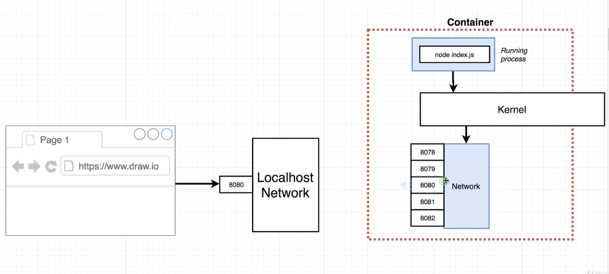

By default, no incoming traffic going into a computer. So, wee have to do 
a port mapping. This is only affecting the incoming requests. The mapping 
can be done with an adjustment we do to the way we are calling the docker 
run. 

```
> docker run -p 8080:8080 beep/simple_web
```

where the first port is the port we are mapping from (route incoming request to 
this port on local host to) and the second is the port 
we are mapping to (port inside the container). 


### 45. Specifying a working directory 

we are going to start a shell inside the container:

```
> docker run -it beep/simple_web sh
/ # ls
Dockerfile         lib                package.json       sys
bin                media              proc               tmp
dev                mnt                root               usr
etc                node_modules       run                var
home               opt                sbin
index.js           package-lock.json  srv
```

maybe we do not want the `*js, *json` files to be in the root directory. We can 
add to the `Dockerfile`
```
WORKDIR /usr/app
```
Any following command will be executed relative to this path in the container. 
If the folder does not exist in the container, it will be created. We have 
to do some steps, since the cache now cannot be used again, as we changed 
a line above. In order to see the file structure, we can now get the container 
running, open another terminal, do 

```
> docker ps
CONTAINER ID        IMAGE               COMMAND                  CREATED             STATUS              PORTS                    NAMES
a29a79a379c8        beep/simple_web     "docker-entrypoint.s…"   5 seconds ago       Up 4 seconds        0.0.0.0:8080->8080/tcp   flamboyant_kapitsa
> docker exec -it a29a79a379c8 sh
/usr/app # ls
Dockerfile         node_modules       package.json
index.js           package-lock.json
/usr/app # 
```
Notice that we enter directly into the /usr/app directory. 

### 46. Unnecessary rebuilds 

Imagine we wanted to modify something in `index.js` for the container. Can 
we avoid rebuilding it again? If we modify the files and rebuild, it 
is going to rebuild again all the steps after `COPY ./ ./`, since docker 
realized there was a change in this step. Is there a workaround? 

### 47. Minimizing cache busting and rebuilds

In the Dockerfile we can split `COPY ./ ./` into two, 

```
COPY ./package.json ./
RUN npm install
COPY ./ ./ 
```
Now, the `npm install` step will only be executed again if the file 
`package.json` changes. 

It is recommended then to segment out the copy operations making sure you copy the 
minimum needed for each successive step. 


## Section 5: Docker compose with multiple local containers

### 49. App Overview 
The goal is to create a container that contains a web application that tells us
how many times the server has been visited. We need two different components: 
`node, redis`. You can think of redis as a tiny data base that is entirely
inside of memory. 

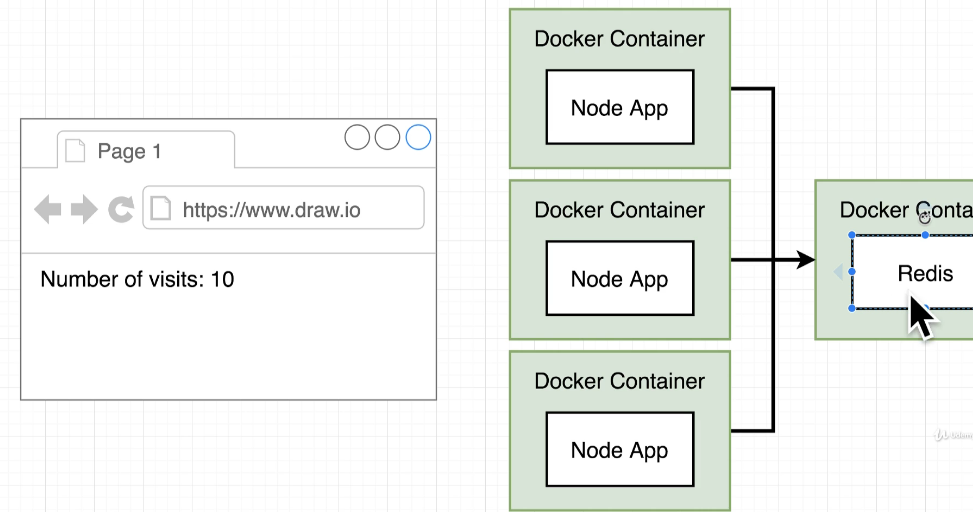


### 50. App Server Starter code

See code here:  [visits](./code/visits,). 

### 51. Assembling a Dockerfile

See Dockerfile here [Docerfile](./code/visits.Dockerfile). TWe can now build 
and tag the Dockerimage: 

```
docker build -t beep/visits:latest .
```

### 52. Introducing Docker compose

If we try to run the newly created image, we will get an error: 
```
>docker run beep/visits 

> @ start /app
> node index.js

Listening on port 8081
events.js:292
      throw er; // Unhandled 'error' event
      ^

Error: Redis connection to 127.0.0.1:6379 failed - connect ECONNREFUSED 127.0.0.1:6379
    at TCPConnectWrap.afterConnect [as oncomplete] (net.js:1141:16)
Emitted 'error' event on RedisClient instance at:
    at RedisClient.on_error (/app/node_modules/redis/index.js:406:14)
    at Socket.<anonymous> (/app/node_modules/redis/index.js:279:14)
    at Socket.emit (events.js:315:20)
    at emitErrorNT (internal/streams/destroy.js:100:8)
    at emitErrorCloseNT (internal/streams/destroy.js:68:3)
    at processTicksAndRejections (internal/process/task_queues.js:84:21) {
  errno: -111,
  code: 'ECONNREFUSED',
  syscall: 'connect',
  address: '127.0.0.1',
  port: 6379
}
npm ERR! code ELIFECYCLE
npm ERR! errno 1
npm ERR! @ start: `node index.js`
npm ERR! Exit status 1
npm ERR! 
npm ERR! Failed at the @ start script.
npm ERR! This is probably not a problem with npm. There is likely additional logging output above.

npm ERR! A complete log of this run can be found in:
npm ERR!     /root/.npm/_logs/2020-06-03T19_52_52_932Z-debug.log
```

the application is attempting to start up but there is no redis server 
available for it to connect to. We focus on giving a separate container 
running a redis server. We do `docker run redis`, this is the redis instance 
we are going to use. If we try to run our  image again, we still have the same 
problem, since the two containers are two independent isolated processes and 
there is no communication whatsoever between the two. We need to have some 
networking infrastructure between the two. There are two options: 

1. Use Docker CLI's network features (pain in the "neck")
2. Use Docker compose, a separate CLI that gets installed along with Docker. It 
   is used to start multiple containers at the same, and automates some of the 
   long-winded arguments we were passing to `docker run`


### 53. Docker compose files

To make use of Docker compose, we are going to encode the docker-cli commands in 
a file called `docker-compose.yml`. This is what it will contain, 

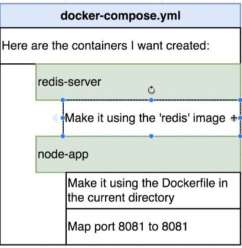

Docker compose file: 

```
 1 version: '3'                                                                                                                                                                                                   
  2 services:  # type of containers                                                                                                                                                                                
  3   redis-server:                                                                                                                                                                                                
  4     image: 'redis'                                                                                                                                                                                             
  5   node-app:                                                                                                                                                                                                    
  6     build: .                                                                                                                                                                                                   
  7     ports:                                                                                                                                                                                                     
  8       - "4001:8081"
```
Docker compose is now going to create the two containers in the same network.
We have to edit `node.js` and add the host `'redis-server` in the function 
`redis.createClient()`.

### 55. Docker compose commands

The command is `docker-compose up`. If we wanted to rebuild anything, we would 
have to run `docker-compose up --build`.  We run it and we see in the output: 

```
Creating visits_node-app_1     ... done
Creating visits_redis-server_1 ... done
```
notifying that one instance of each was created. Now we can open `localhost:4001`
in a browser, and refresh the page to check that the number of visits inclreases.

### 56. Stopping docker compose containers.

With docker compose, we can start a group of containers in the background and 
then close all containers at the same time with one 
single command.

- Launch in the background: `docker compose up -d`
- Stop containers: `docker-compose down`

### 57. Container maintenance with compose

How to deal with containers that crash? Let us see how to restart our container
everytime there is something that makes the software inside of it crash.

as an example, we can modify the `index.js` file, by adding: 
```
const process = require('process');
# inside of function app.get
process.exit(0);
```

To test it, we run: `docker-compose up --build`. When opening the URL, we see
the message: `This page isn't working`, and in the terminal, we see `visits_node-app_1 
exited with code 0`. We run a `docker ps` and see that the `node-app` container is 
no longer running. 

### 58. Automatic container restart

We exited with 0, so it is assumed, everything was OK. Let's see a summary of 
restart policies: 
- **"no"**: never attempt to restart this container if it stops or crashes (default).
- **always**: if this container stops *for any reason*, always attempt to restart it.
- **on-failure**: ony restart if the container stops with an error code. 
- **unless-stopped**: allways start unless we (the developers) forcibly stop it.

To implement the **always** policy to the container `node-app`, in the 
docker-compose file, we add: `restart: always` inside the `node-app` bit.
Do not forget to entour the word "no" with quotes if you used it. 

### 59. Container status with docker compose. 

I can print out the status of a docker compose by running: 

```
docker-compose ps
```
I have to run from the folder where the file docker-compose.yml is sitting.


## Section 6: Creating a production grade workflow

### 60. Development workflow

How do we actually develop an application that uses docker. Workflow: 

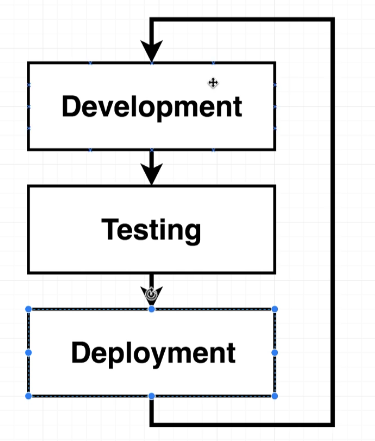

### 61. Flow specifics

Here, git-flow is revisited... basically. When the 
code is merged to master, then the application is pushed to Travis CI (it is 
going to run tests on your application). Assuming the Travis CI is able to 
pull the code and run the tests successfully, it will push it to some 
AWS (Amazon web servers). 

### 62. Docker's purpose 

Docker is actually a tool in all this development flow. It makes some of these 
tasks a lot easier. 

### 63-66. Project generation

We will use a react application for the project. `node` has to be installed 
in your local computer. To install and create a front end react application, 
we run, 
```
> npx create-react-app frontend
```
See [getting-started](https://create-react-app.dev/docs/getting-started#npx)

### 67. Necessary commands
We go into the `frontend` directory. We need to be aware of the following three commands:
- `npm run start`: starts up a development server. *For development use only*
- `npm run test`: runs test associated with the project
- `npm run build`: builds a production version of the application.
Maybe, it'd be interesting to have two docker containers: one in development and 
one in production. 


### 68. Creating the dev Dockerfile

We create a `Dockerfile.dev` for development. 

```
  1 FROM node:alpine                                                                                                                                                                                               
  2                                                                                                                                                                                                                
  3 WORKDIR '/app'                                                                                                                                                                                                 
  4                                                                                                                                                                                                                
  5 COPY package.json .                                                                                                                                                                                            
  6 RUN npm install                                                                                                                                                                                                
  7                                                                                                                                                                                                                
  8 COPY . .                                                                                                                                                                                                       
  9                                                                                                                                                                                                                
 10 CMD ["npm", "run", "start"]        
```

Now, we have to build our project with a custom Dockerfile name:

```
docker build -f Dockerfile.dev .
```

### 69.  Duplicating dependencies

When running docker build, the following message was shown: 

```
Sending build context to Docker daemon  188.8MB
```

Actually, we are copying the fodler `node_modules` that contains the dependencies. 
However, this dependency folder is created again when running `RUN npm install`. 
We do not want two copies of the dependencies, so we delete the folder 
`node_modules` and invoke the build process again. We will see that it is 
much faster this time. 

### 70-71. React-app exits immediately with docker run command/ Starting the container
Due to a recent update in the Create React App library, we will need to change how we start our containers.

In the upcoming lecture, you'll need to add the -it flag to run the container in interactive mode:
```
docker run -it -p 3000:3000 CONTAINER_ID 
```

Now, we do some changes to our code: edit `App.js` and replace the text: `Edit...`
with `Hi there`. In order for our changes to be reflected in our container, 
we either need to rebuild or come up with a cleverer solution, without us 
needing to stop it, rebuild the image and start it again.

### 72. Docker volumes

We are going to make use of a docker volume. We are not copying over the 
folders, but putting a reference to the folders in the local machine. We are 
establishing a mapping from a folder inside the container to a folder outside 
the container. Syntax


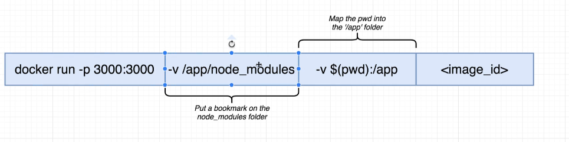

### 74. Bookmarking volumes

Notice the option `-v /app/node_modules` is present because we deleted the 
folder `node_modules` outside the container in order for it not to be copied over 
when the container is created. This folder is going to be present in the container 
(it is created when running `RUN npm install`). So, we pass the option `-v` 
without colons with the folder that is present in the container and not present 
in our original folder. If you ran `docker run` without this option, an error 
message will be displayed, since the dependencies will not be found. 
What this option is saying is: this folder is inside the container, is OK as 
it is, do not try to map it up against anything else. 

Now, we can run: 

```
 docker run -it -v /app/node_modules -v $(pwd):/app  -p 3000:3000 701c5fea0c7b
```

and then modify the file `App.js` in your local folder (you can write now: 
    *Bye, there*), it should get automatically refreshed in your 
`localhost:3000`. Any changes made in our local system are propagated inside 
the container. 

### 75. React app exited with code 0

Recently, a bug was introduced with the latest Create React App version 
that is causing the React app to exit when starting with Docker Compose.
To Resolve this:
Add `stdin_open` property to your `docker-compose.yml` file

```
1|  web:
2|     stdin_open: true
```

Make sure you rebuild your containers after making this change with  
`docker-compose down && docker-compose up --build`

https://github.com/facebook/create-react-app/issues/8688

https://stackoverflow.com/questions/60790696/react-scripts-start-exiting-in-docker-foreground-cmd

### 76. Shorthand with Docker compose

We can use `docker-compose` to tremendously simplify the command we need to use
to run the container. We create a `docker-compose.yml` file, and inside that 
file we specify the port and the volumes. 

```
  1 version: '3'
  2 services:
  3   web:
  4     stdin_open: true
  5     build:
  6       context: .
  7       dockerfile: Dockerfile.dev
  8     ports:
  9       - "3000:3000"
 10     volumes:
 11       - /app/node_modules
 12       - .:/app
```

### 77. Overriding Dockerfile selection

   Note that `build` has now two fields: `context` that will specify the 
folders where to look into, and `dockerfile` that indicates the Dockerfile 
that will be used to build the system.

### 79.  Do we need Copy? 

  We can now change the code again and check that it is refreshed in the 
  web application. The question you might be asking is: do we actually need 
  then the line `COPY . .`? Probably yes, but it might be convenient to leave 
  this instruction in, since in the future you might decide to use this for 
  something else. So, basically it is a good practice to leave it in as a 
  reminder or a reference for ourselves.

### 80. Executing tests

  Now we have a solid infrastrcture place to run our container in a development 
  environment. Now, we move the focus to running the tests inside of our container.

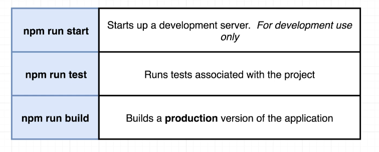

 We can run the tests like so: 

 1. Build the docker image, 
 2. Run docker run with the container id and the commmand we want to run: 
 `docker run -it 00f997f17f45 npm run test` and the test suit will be run 
 in interactive mode. 

### 81. Live updating tests

The test executed in section 80 is in `app/src/App.test.js`. Let's try to 
do a modification to this file. If we want these changes to take effect 
inside the container, we need the volumes set up. One way of doing this is 
to create another service in our docker-compose file. Another way would be 
to attach to the existing container that is created.

We run `docker-compose up` in a terminal to have our container running, 
   and in another terminal we do: 

```
frontend (master *%| docker ps
CONTAINER ID        IMAGE               COMMAND                  CREATED             STATUS              PORTS                    NAMES
429830540f31        frontend_web        "docker-entrypoint.s…"   55 minutes ago      Up 2 minutes        0.0.0.0:3000->3000/tcp   frontend_web_1
frontend (master *%| docker exec -it 429830540f31 npm run test
```

This is definively a solution, but not the best one to use. 

### 82. Docker compose  for running tests

We add a second service to the docker-compose file that will be solely 
responsible for the test suite. 

```
  1 version: '3'
  2 services:
  3   web:
  4     stdin_open: true
  5     build:
  6       context: .
  7       dockerfile: Dockerfile.dev
  8     ports:
  9       - "3000:3000"
 10     volumes:
 11       - /app/node_modules 
 12       - .:/app
 13   tests:
 14     stdin_open: true
 15     build:
 16       context: .
 17       dockerfile: Dockerfile.dev
 18     volumes:
 19       - /app/node_modules
 20       - .:/app
 21     command: ["npm", "run", "test"]                                                                                                                                                                            
```

There is a downside to this approach. We do not have the ability to enter 
any standard in output to this container. 

### 84. Shortcomings on testing

You might think, a way around this is to open a terminal and use the 
docker attach command. It is not going to work. We can start a shell 
to understand better why that is. 

```
docker exec -it  67b11603c7ee sh
/app # ps
PID   USER     TIME  COMMAND
    1 root      0:00 {node} npm
   18 root      0:00 node /app/node_modules/.bin/react-scripts test
   25 root      0:03 node /app/node_modules/react-scripts/scripts/test.js
   83 root      0:00 sh
   88 root      0:00 ps
```

When `npm run test` is run, what it is actually happening, is that npm is 
actually launching **another** process,  `react-scripts test` that is actually 
running the processes. However, with docker attach, you can only attach to primary 
processes, not to secondary ones. 

### 85. Need for Nginx

The next question is: how can we use the docker container to build a production 
version of the application. 

For development: 


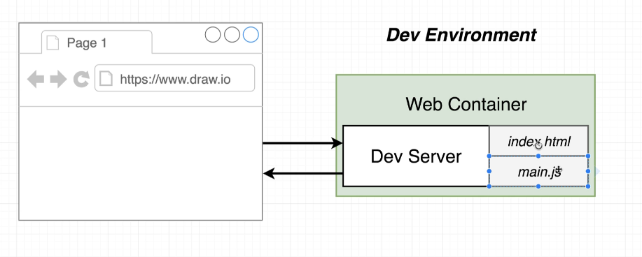

For production:

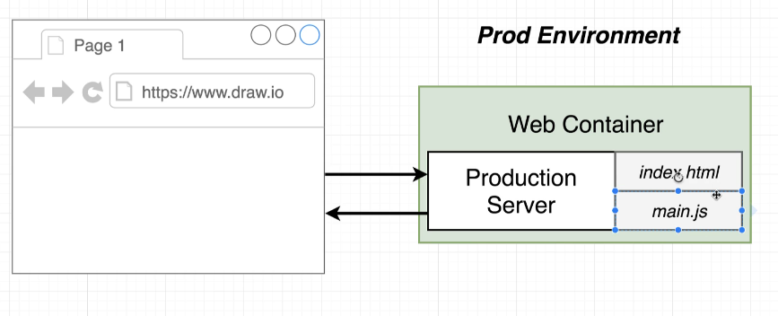

As a production server, we can use `Nginx`. We are going to create a second 
Dockerfile that is going to create a production version of the web container. 
It is going to start an `Nginx` instance.

### 86. Multi-step docker builds

There is two issues when creating our container with the production environment: 

- We only need the dependencies for the build process. Afterwards, it'd be 
desirable to remove them. 
- Where will the `Nginx` server come from?  --> [docker hub](https://hub.docker.com). 
  However, we are already using `node:alpine` inside of our container. 

It would be really nice to have two different base images. We are going to 
build a Dockerfile that has a multistep build process:

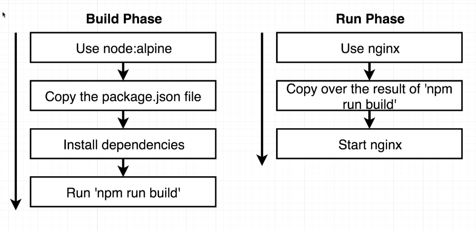

### 87. Implementing Multi-step builds

The Dockerfile looks like this: 

```
  1 # Builder phase
  2 FROM node:alpine as builder
  3 WORKDIR '/app'
  4 COPY package.json .
  5 RUN npm install
  6 COPY . .
  7 RUN npm run build
  8 # The stuff we are about is under /app/build
  9
 10 # Run phase
 11 FROM nginx
 12 # With --from=builder specifies the phase we want to copy stuff from
 13 # The destination directoy is given in the usage page of the nginx container.
 14 COPY --from=builder /app/build /usr/share/nginx/html
```

Our image is going to be relatively small. It is going to be as big as the 
`nginx` image is.

### 88. Running Nginx

We test the previous section Dockerfile, by running: 

```
> docker build .
> docker run -p 8080:80 3fa9c4c72604
```
We have our production code ready. 


## Section 7: continuous integration and deployment with AWS

This section is about how to implement this flow: 

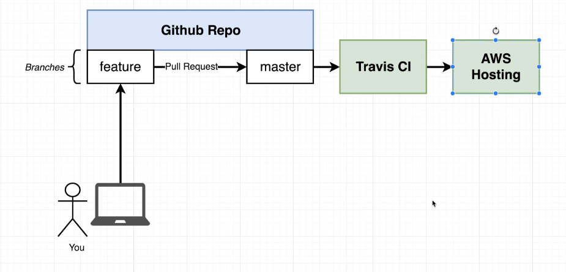

Since thiss is very out of scope, we will give a very brief description of this
section. 

1. Create a repository, see [my-github-page](https://github.com/PaulaAlessio/docker-react).
2. Set up Travis CI: travis CI watches upon any changes we do to the repo, 
    see [here](https://travis-ci.org). Login and let Travis watch on your repo.
3. Configure Travis CI and make it do some work for us. See `.travis.yml`
   in the repository above. Then, we can go to my travis-ci and see this!
   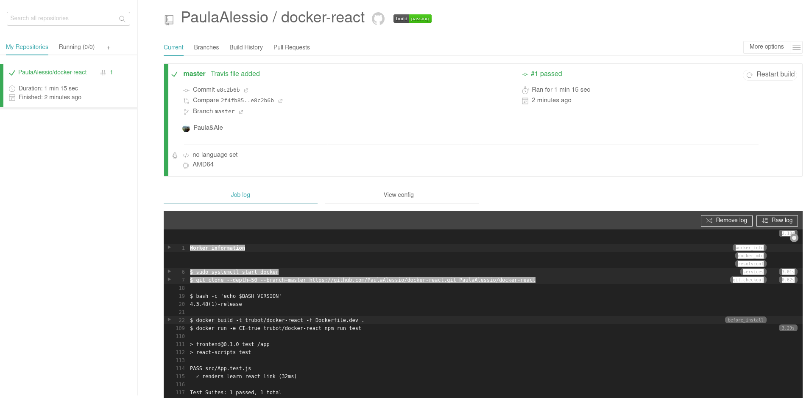
4. The idea is then to put the production code into an amazon web server, which 
   I won't do. Steps:
    - `AWS services -> elastic Beanstalk`.
    - Create a new application (give it the name you want).
    - Select `weeb server environment`.
    - Under `platform` select `docker`
    - Click on `create environment`.
5. Diagram on AWS:
   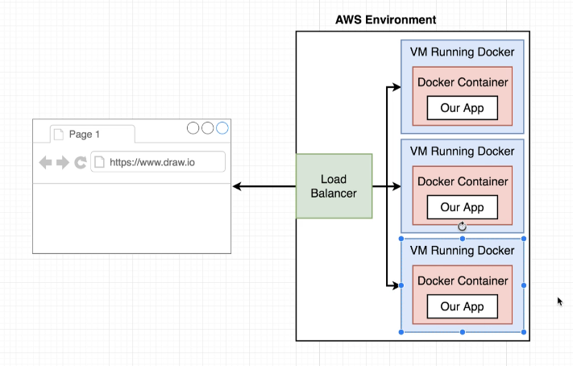
6. You can configure Travis CI to deploy an application in AWS, see commented lines in `.travis.yml`.   
   You need to create a user, attach existing policies directly (provides full access checkbox)
   (you get the API keys of which the private that can be visualized only **once**). 
   The keys can be stored in Travis (settings->Environment variables)

### Note  
Required Travis Updates

In the upcoming lecture we will be adding a script to our .travis.yml file. Due to a change in how the Jest library works with Create React App, we need to make a small modification:

    script:
      - docker run USERNAME/docker-react npm run test -- --coverage

instead should be:

    script:
      - docker run -e CI=true USERNAME/docker-react npm run test

Additionally, you may want to set the following property to the top of your .travis.yml file:

    language: generic 

You can read up on the CI=true variable [here](https://facebook.github.io/create-react-app/docs/running-tests#linux-macos-bash)

Secret  keys have to be registered as: 
```
access_key_id: $AWS_SECRET_KEY
secret_access_key: $AWS_SECRET_KEY
```


